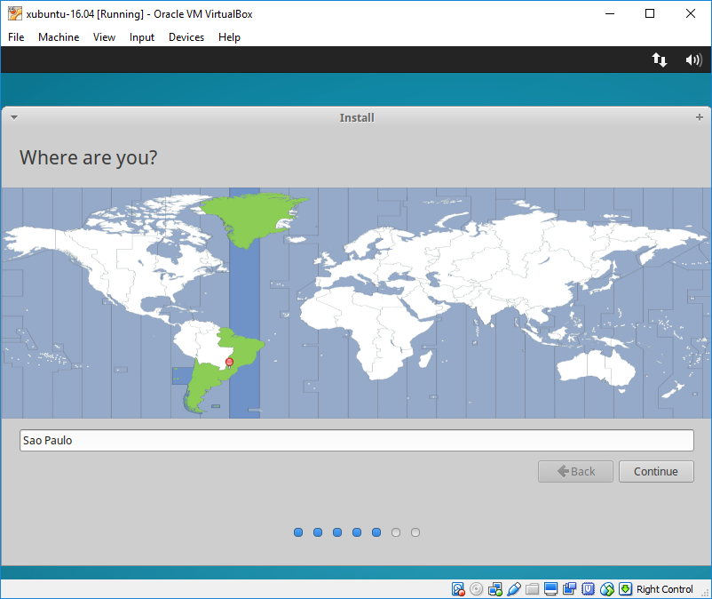
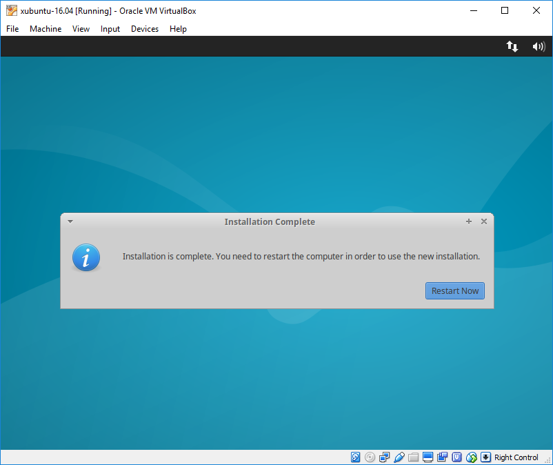

# Virtual Machine Installation

Steps to configure a [Xubuntu](https://xubuntu.org/) 16.04 virtual machine to work with Python and C++ and other tools. The base environment will be composed by:

- C++ (g++)
<!---- Cling --->
- Python (Anaconda)
- Thonny
- Visual Studio Code
- FreeCAD

## Virtual Machine

Download the [Xubuntu 16.04](http://mirror.us.leaseweb.net/ubuntu-cdimage/xubuntu/releases/16.04/release/xubuntu-16.04.2-desktop-amd64.iso) installation image.

Install [Oracle VM VirtualBox](https://www.virtualbox.org/) on your machine. After the installation, start the VirtualBox and create a virtual machine following the steps:


Adjust the amount of memory accordingly to the host machine memory. It is recommended to use at least 2GB of memory to the virtual machine.


50GB is the maximum space this virtual machine will need, no need to use more. A minimum of 20GB is recommended.


Edit the virtual machine settings to match these images (adjust the number of CPUs to your machine, minimum of 2 CPUs recommended).


Start the virtual machine and use the downloaded Xubuntu image to start the OS installation.
The first installation step is a click on `Install Xubuntu`, almost all subsequent steps will just require a click on `Continue`. Of course, user yout username and pick a password you'll remember later.







In the end of the process, click on `Restart Now` and later press `Enter` to restart.

----------

## Update the OS and configure VirtualBox additions

After install the virtual machine, on the first log in, execute the following commands in a terminal:
```sh
sudo apt update
sudo apt upgrade --yes
sudo apt autoremove --yes
```

This will update Xubuntu to the latest stable version. Then install the *VirtualBox Guest Additions*, this is performed by clicking on the menu shown here:

	

and using the command: 

```sh
sudo /media/aguirre/VBOXADDITIONS_5.1.28_117968/VBoxLinuxAdditions.run
sudo adduser $USER vboxsf
```

After the installation is finished, click on the CD symbol on the desktop and click `Eject`. 

On your host machine, create a folder called "linux" anywhere you want, this folder will be used to share files between the host machine and the virtual machine.

[Configure a shared folder](https://www.howtogeek.com/187703/how-to-access-folders-on-your-host-machine-from-an-ubuntu-virtual-machine-in-virtualbox/) on VirtualBox, clicking on the `Device -> Shared Folders` menu. Point to the folder you have created previously (on your host machine) and check the options to auto mount and make the sharing permanent . Restart the machine to the changes to take effect and create a symbolic link inside the user's home folder.

```sh
ln --symbolic /media/sf_shared/ $HOME/windows
```

The `windows` folder on your `home` folder is now linked to your host machine `linux` folder. You can use this folder to exchenge files between the two.

## Install the programming packages and additional software

To install the packages, you can use the commands here, or use the links to go to the software page and try to search installations instructions there (recommended). 

- [FreeCAD](https://www.freecadweb.org/)
```sh
sudo add-apt-repository ppa:freecad-maintainers/freecad-stable
sudo apt-get update
sudo apt install freecad --yes
```

- C++ compiler and standard libraries

```sh
sudo apt install build-essential --yes
```

- Version control and C++ tools ([Git](https://git-scm.com/) and [CMake](https://cmake.org/))

```sh
sudo apt install git cmake --yes
```

- [Anaconda](https://anaconda.org/) Python 3 (and configure `$PATH` and `Conda-Forge`)

```sh
wget --directory-prefix=$HOME/Downloads https://repo.continuum.io/archive/Anaconda3-5.0.0.1-Linux-x86_64.sh
echo -ne '\n' | bash ./Downloads/Anaconda3-5.0.0.1-Linux-x86_64.sh -b -p $HOME/apps/anaconda3
cp .bashrc .bashrc_backup
echo -ne '\n' >> .bashrc
echo "# Anaconda3 path" >> .bashrc
echo "export PATH=\$HOME/apps/anaconda3/bin:\$PATH" >> .bashrc
$HOME/apps/anaconda3/bin/conda config --add channels conda-forge
$HOME/apps/anaconda3/bin/conda update --prefix $HOME/apps/anaconda3 anaconda --yes
```

If you want to try `conda` now, open a new terminal to make the changes on `.bashrc` to work.

- [Thonny](http://thonny.org/) (VERY simples Python IDE)

```sh
wget --directory-prefix=$HOME/Downloads https://bitbucket.org/plas/thonny/downloads/thonny-2.1.11.sh
echo -ne '\n\n' | bash ./Downloads/thonny-2.1.11.sh
echo -ne '\n' >> .bashrc
echo "# Thonny path" >> .bashrc
echo "export PATH=\$HOME/apps/thonny/bin:\$PATH" >> .bashrc
```

- [Visual Studio Code](https://code.visualstudio.com/) (C++ and Python IDE)

```sh
wget https://go.microsoft.com/fwlink/?LinkID=760868 --output-document=$HOME/Downloads/code_1.17_amd64.deb
sudo dpkg -i $HOME/Downloads/code_1.17_amd64.deb
sudo apt-get install -f
```
<!---
- [Cling](https://root.cern.ch/cling) (C++ interpreter)

```sh
wget --directory-prefix=$HOME/Downloads https://root.cern.ch/download/cling/cling_2017-10-11_ubuntu16.tar.bz2
tar --extract --bzip2 --verbose --file=$HOME/Downloads/cling_2017-10-11_ubuntu16.tar.bz2 --directory=$HOME/apps
echo "# Cling path" >> .bashrc
echo "export PATH=\$HOME/apps/cling_2017-10-11_ubuntu16/bin:\$PATH" >> .bashrc
```
--->

## Configure the Python environment 

Create a new `conda` environment on a new terminal and install scientific Python packages

```sh
$HOME/apps/anaconda3/bin/conda create --name=notebook --yes
source $HOME/apps/anaconda3/bin/activate notebook
$HOME/apps/anaconda3/envs/notebook/bin/conda install numpy scipy matplotlib --yes
$HOME/apps/anaconda3/envs/notebook/bin/conda install sympy pandas seaborn --yes
$HOME/apps/anaconda3/envs/notebook/bin/conda install jupyter --yes
```
<!---
[Configure](https://github.com/root-project/cling/tree/master/tools/Jupyter) the `Cling` interpreter to integrate with `Jupyter notebook`
```sh
pip install -e $HOME/apps/cling_2017-10-11_ubuntu16/share/cling/Jupyter/kernel/
$HOME/apps/anaconda3/envs/notebook/bin/jupyter-kernelspec install --user $HOME/apps/cling_2017-10-11_ubuntu16/share/cling/Jupyter/kernel/cling-cpp11
$HOME/apps/anaconda3/envs/notebook/bin/jupyter-kernelspec install --user $HOME/apps/cling_2017-10-11_ubuntu16/share/cling/Jupyter/kernel/cling-cpp14
$HOME/apps/anaconda3/envs/notebook/bin/jupyter-kernelspec install --user $HOME/apps/cling_2017-10-11_ubuntu16/share/cling/Jupyter/kernel/cling-cpp17
source $HOME/apps/anaconda3/envs/notebook/bin/deactivate
```


- Remarkable
```sh
wget --directory-prefix=$HOME/Downloads https://remarkableapp.github.io/files/remarkable_1.87_all.deb
sudo dpkg -i $HOME/Downloads/remarkable_1.87_all.deb
sudo apt-get install -f
```
--->

Done, restart the virtual machine (just to be sure) and you can use it (and customize it, give it a try).

Cheers.
> Written with [StackEdit](https://stackedit.io/).